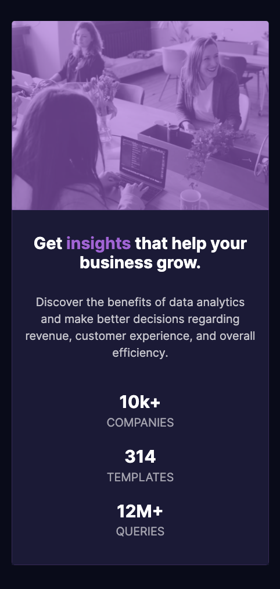

# Stats preview card component 
## Table of contents

- [Overview](#overview)
  - [The challenge](#the-challenge)
  - [Screenshot](#screenshot)
  - [Links](#links)
- [My process](#my-process)
  - [Built with](#built-with)
  - [Useful resources](#useful-resources)
- [Author](#author)

## Overview

### The challenge

Users should be able to:

- View the optimal layout depending on their device's screen size

### Screenshot

### Links

- Github: [https://github.com/CFox2019/stats-preview-card-component](https://github.com/CFox2019/stats-preview-card-component)
- Live Link: [https://cfox2019.github.io/stats-preview-card-component/](https://cfox2019.github.io/stats-preview-card-component/)

## My process

I started the project with building out all the HTML first and with mobile-first responsiveness. After the HTML was complete, I started styling top to bottom. After the initial styles were added, I made the card desktop responsive as well using CSS Flexbox styles.
### Built with

- HTML
- CSS custom properties
- Flexbox
- Bootstrap
- Mobile-first workflow
### Useful resources

- [https://css-tricks.com/snippets/css/a-guide-to-flexbox/](https://css-tricks.com/snippets/css/a-guide-to-flexbox/) - This helped me with using flexbox.
## Author

- Portfolio - [Courtney Fox](https://cfox2019.github.io/Portfolio-React-Edition/#/)
- Frontend Mentor - [@CFox2019](https://www.frontendmentor.io/profile/CFox2019)
- LinkedIn - [@cdfox](https://www.linkedin.com/in/cdfox/)
